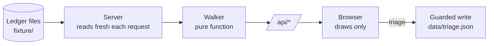

# Lineage View

**See exactly where a piece of work got stuck, and who needs to fix it.**


Lineage View is a small web app that reads a ledger of work signals (meeting notes, chat threads, emails) and shows how far each one travelled through a four-step pipeline:

```
signal  →  analysis  →  summary  →  written-back artifact
```

When a chain stops short, it draws the break at the exact link where it failed, says why in plain words, and suggests the next step.

It is built on Supanova's **Inbox** system, using a synthetic fixture. No real data is included.

<!-- Add a screenshot: save it as docs/screenshot.png and uncomment the next line -->
<!--  -->

---

## Why it exists

A ledger of 77 signals can show dozens of problems. Most of them come from a few shared causes, such as a broken export, a dead feed, or a typo in a routing rule. A flat list of "errors" hides that, and people stop trusting a screen that is always red.

Lineage View is built around three ideas:

1. **Follow one chain end to end.** Every signal is traced through its four steps, and the break is shown where it happens.
2. **Don't cry wolf.** "Provably wrong", "missing or stalled" and "just waiting" are different things and look different.
3. **Say it once.** If 23 chains share one cause, it is one finding at the top, not 23 alarms.

---

## Features

- Project list with colour-coded counts and a legend
- A four-stage pipeline per chain, with the break drawn as a dashed red or amber link
- A banner of problems that affect many chains (dead feed, failed ingest runs, a dropped routing hint, an export that never fills in summaries)
- Filters: All, Broken, Gap, Pending, Healthy
- A plain-words explanation for every issue, with the owner and fix steps
- Triage: Acknowledge, Won't fix (with a note), Reopen, with a saved history
- Loading, empty, no-match, server-error and save-failure states
- Light and dark mode, keyboard-friendly controls, and a layout that adapts from narrow phones to ultrawide screens (checked in Chromium)
- No dependencies, no build step, no accounts, no API keys

---

## Quick start

You need **Node 18 or newer**. Nothing else is installed.

```bash
git clone https://github.com/Adityakrshah/lineage_view.git
cd lineage_view
node server.js
```

Open **http://127.0.0.1:3000**.

Run the tests:

```bash
npm test
```

### Settings

All optional.

| Variable | Default | What it does |
|---|---|---|
| `PORT` | `3000` | Port to listen on |
| `FIXTURE_DIR` | `fixture` | Folder the ledger files are read from |
| `DATA_DIR` | `data` | Folder where triage decisions are saved |
| `ANTHROPIC_API_KEY` | not set | Lets "Explain" ask a model (see [Explanations](#explanations)) |
| `EXPLAIN_MODEL` | `claude-sonnet-4-6` | Model used when a key is set |

---

## How to read the screen

| Label | Meaning |
|---|---|
| **Broken** | A link is provably wrong |
| **Gap** | A stage is missing or stalled |
| **Pending** | Waiting, not a fault |
| **Healthy** | Fully written back |

Colour is never the only signal. Every stage shows an icon and a word, so the screen also works for colour-blind users.

---

## How it works



**The server decides, the browser draws.** The server reads the ledger on every request and runs the walker. The browser never holds ledger data. It only calls `/api/*`.

**The walker is a pure function.** It takes the ledger, config, routing hints and run log, and returns chains, project counts and fleet findings. It does no file access and never calls a model, which makes it easy to test and gives the same answer every time.

**Chains are per signal and per project.** Status is stored per project, so one meeting sent to two projects has two chains that can differ. A chain is keyed by `id@time:project`, because some ids repeat at different times.

**Only the first break is reported.** Stages after it are marked blocked and dimmed, since they cannot happen yet.

### What counts as an issue

| Severity | Kinds |
|---|---|
| **Error** (Broken) | `unknown_project`, `duplicate_id`, `status_orphan_key`, `bad_state`, `analysis_ref_missing`, `analysis_ref_malformed`, `analysis_ref_dangling`, `analysis_cites_missing_source`, `analysis_time_travel` |
| **Warning** (Gap) | `unrouted`, `possible_duplicate`, `detected_during_failed_run`, `stalled`, `analysis_no_evidence`, `summary_missing`, `artifact_missing` |

A chain is **Pending** when it was routed recently and nobody has started yet, or when it is deferred. That is not a fault.

### Fleet findings

The banner at the top collects things that affect many chains:

- **Systemic gaps.** If at least 5 analyzed chains exist and 90% or more lack the same thing, it is reported once as a probable data-source problem. Chains that were never analyzed are not counted, so they cannot hide the pattern.
- **Dark feeds.** A feed counts as dark when it saw no files and its newest file was older than the freshness limit, for at least 5 runs in a row.
- **Failed ingest runs.**
- **Dropped routing hints.** A hint pointing at a project that does not exist, with a "did you mean" suggestion and how many unsorted signals it would have caught.
- **Unverifiable references.** Analysis references to runs the run log has no record of.

---

## API

| Route | Purpose |
|---|---|
| `GET /` | The page |
| `GET /api/overview` | Projects with counts, fleet findings, saved triage |
| `GET /api/chains?project=ID` | Every chain for one project |
| `POST /api/explain` | Explanation for one issue on one chain |
| `POST /api/triage` | Save a triage decision (the only write) |

Errors are explicit:

| Status | When |
|---|---|
| `503` | A fixture file is missing or unreadable. The message names the file. |
| `400` | Invalid input |
| `403` | A POST without a JSON content type, or from a different origin |

The server only listens on `127.0.0.1`.

### Safe writes

The ledger is **never written**. The only thing saved is a triage decision, to `data/triage.json`, through one function in `src/store.js`:

1. The chain must exist, the issue must be on that chain, and the action must be `acknowledged`, `wont_fix` or `reopened`.
2. Notes are at most 500 characters, and "Won't fix" requires one.
3. Writes happen one at a time.
4. The file is written to a temp copy, flushed, then renamed. A crash cannot leave a half-written file.
5. The history is kept in the same file, so the current state and the audit trail cannot disagree.

Request bodies are capped at 10 KB. Ledger text is always rendered as text (`textContent`), never as HTML, so a hostile title cannot inject markup.

---

## Explanations

**Code decides what is broken. A model only helps explain it.**

By default no model is used. A fixed template for each issue kind gives the likely cause, who acts, and the fix steps. It works offline and needs no key. The screen labels it *Built-in explanation (rule-based, not AI)*.

If `ANTHROPIC_API_KEY` is set, the model receives only a small structured record about one issue, not the whole ledger. It must answer in a fixed JSON shape, and it is told that titles and file names are data, not instructions. Its answer is checked before it is shown:

- The shape must be right.
- Every run number, date and email it mentions must appear in the facts it was given.
- If anything fails (bad shape, an invented id, a network error), the screen falls back to the template and says why.

A model answer is labelled *AI-drafted, verify before acting*.

> The model path is covered by tests that use a mocked network call. It has not been run against the live API.

---

## Project layout

```
server.js              HTTP server and routes (no dependencies)
src/lineage.js         The walker: pure, no file access, no model
src/explain.js         Templates plus the optional, guarded model call
src/store.js           The single guarded write path
public/index.html      The whole front end (one file, no CDN, no build)
test/lineage.test.js   11 tests
fixture/               Synthetic ledger, config, routing hints, run log
data/                  Created at run time, holds triage.json (git-ignored)
```

---

## Testing

```bash
npm test
```

The 11 tests cover: a healthy chain, the break at the exact link, dangling versus merely unverifiable run references, an analysis that cites a file the signal does not have, duplicate ids producing two separate chains, unrouted versus stalled versus pending, dark-feed detection and failed-run days, systemic detection, stalled chains not diluting the systemic rate, the typo suggestion for a dropped hint, the write path (validation, atomic write, history, rejection of bad input), and the model guardrails (bad shape, invented id, network failure).

---

## Assumptions

The source data did not define everything, so these choices are stated openly:

1. **Summary** means a signal's `summary` field.
2. **Written-back artifact** means the project-owned `notes` field.
3. **"Now"** is the newest date in the data, never the system clock, so the screen does not change from day to day.
4. A chain is **stalled** after 7 days with no analysis. Before that it is pending.
5. A run reference like `run-999` is **provably dangling** only if it is higher than the newest run in the log. Older references the log simply doesn't contain are counted as "cannot be verified", not as errors.

---

## What the sample data contains

The fixture contains real defects on purpose, and they are handled, not cleaned:

- `summary` is empty on all 77 signals, and `notes` is empty everywhere. The last stage can therefore never be reached, so no chain is Healthy.
- Some ids repeat at different times. The two Northwind portal walkthroughs on 2026-07-22 are separate chains: one points at a run that doesn't exist (`run-999`), the other was never picked up.
- One analysis lists a source file the signal does not have.
- The granola feed was dark for 7 runs (2026-07-27 to 2026-08-04), and runs 131 and 144 failed.
- A routing hint points at `quil`, which isn't a project (probably `quill`), so it is silently dropped.

Totals: 77 chains (northwind 12, harborline 16, quill 14, atlas 15, studio_ops 11, unsorted 9): 9 broken, 66 gap, 2 pending, 0 healthy.

---

## Limitations and choices

- **Read-only on the ledger, by design.** The ledger is the source of truth and is used daily, so this tool can't change it. Fixes happen in the source system; only triage notes are saved here.
- **Local only, no accounts.** It listens on `127.0.0.1` and has no login. This is deliberate for an internal, localhost tool.
- **No paging.** All chains for a project load at once, which is fine at this size (the largest project has 16). It would need paging at a few hundred signals.
- **Older `run-N` references can't be verified.** The run log holds only part of the history, and there is no registry of analysis runs to check against. They are reported as "cannot be verified", not as errors.
- **Export:** each project can be downloaded as JSON (chains plus triage notes). There is no CSV or PDF export.


## Ideas for next steps

- A "fix this first" list that ranks root causes by how many chains one fix would clear
- A timeline of the run log that highlights the dark feed window and failed runs
- A side-by-side view of suspected duplicate meetings
- A registry of analysis runs so older references can be verified
- A diff between two ledger snapshots to show what got better or worse

---

